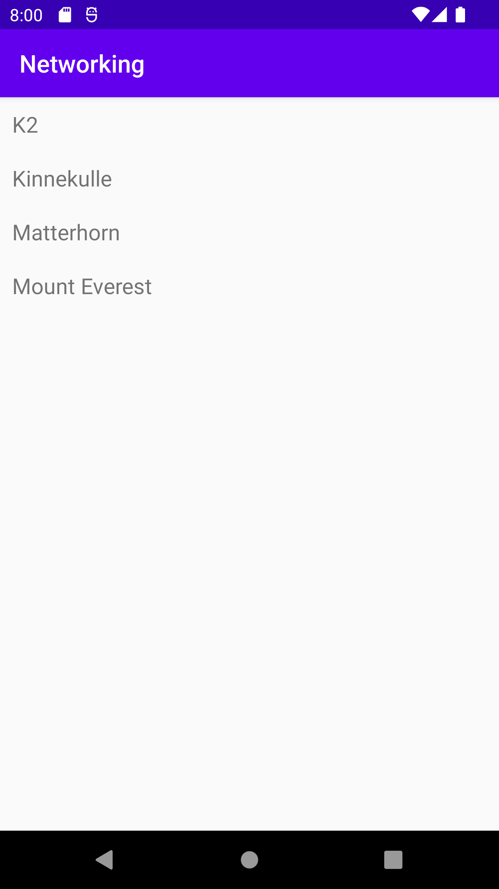

# Rapport

Började med att göra layout för main activity med att lägga in en recycler view. 

```
<androidx.recyclerview.widget.RecyclerView
android:id="@+id/recycler_view"
android:layout_width="match_parent"
android:layout_height="match_parent"
app:layout_constraintStart_toStartOf="parent"
app:layout_constraintEnd_toEndOf="parent"
app:layout_constraintTop_toTopOf="parent"
app:layout_constraintBottom_toBottomOf="parent"/>
```

Därefter gjordes en ny layout xml fil och där gjordes en layout för varje item för arraylist.

```
<TextView
android:id="@+id/title"
android:layout_width="match_parent"
android:layout_height="wrap_content"
android:textSize="18sp"/>
```

Därefter gjordes en ny java klass med som heter “RecyclerViewItem”  och där görs en template för 
varje item.

```
public class RecyclerViewItem {

    private String title;

    public RecyclerViewItem(String title) {
        this.title = title;
    }

    public String getTitle() {
        return title;
    }
}
```

Efter det gjordes den en ny klass som heter “RecuclerViewAdapter”. Därefter gjordes ännu en ny 
klass gjordes som heter “Mountain” som då ska vara data om Json, alltså där deklarerar man 
alla attribut från json-filen.

Därefter arbetades det i MainActivity med att börja med att deklarera en variabel med datatypen 
Gson. Därefter en lista över json som tar data från klassen “Mountain”. Detta användes för att 
hämta data och sätta det i en arraylist så att man kan se det på appen. Men innan behöves det då 
en arraylist som är för klassen RecyclerViewItem. För att sätta in json datan inne i arraylist 
gjordes det genom att använda sig av en foreach sats som går igenom alla attribut och gör en ny 
item för RecyclerViewItem arraylist.

```
Gson gson = new Gson();
Type type = new TypeToken<List<Mountain>>() {}.getType();
List<Mountain> listOfMountain = gson.fromJson(json,type);

ArrayList<RecyclerViewItem> items = new ArrayList<>();

for (Mountain m: listOfMountain) {
    items.add(new RecyclerViewItem(m.getName()));
}
```

Därefter gjordes så att man kan se dessa attribut på appen och detta gjordes med att först hitta 
vilken id som RecyclerView som i är i main activity xml. Därefter gjorde det så att man kan se 
dessa attribut i appen hjälp av variabeln som hittar recyclerView.


